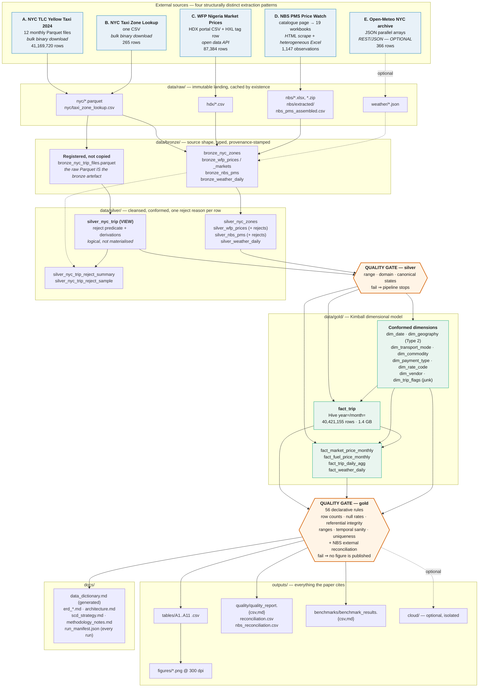

# Pipeline Architecture

A medallion architecture on a local filesystem, with DuckDB as the only engine.
No JVM, no Spark, no database server, no paid service. The entire warehouse is an
in-process query engine reading Parquet from a bind-mounted volume.

## Why bronze is physical for Nigeria and logical for New York

The most consequential architectural decision in this pipeline is an asymmetry,
and it is driven by a hard constraint: a **3 GB disk budget**.

- The Nigerian sources total a few tens of megabytes. They are materialised into
  Parquet at every layer, giving a genuinely immutable landing record for a
  trivial cost.
- The NYC corpus is 661 MB of already-columnar, already-immutable Parquet.
  Copying 41 million rows into bronze and again into silver would consume roughly
  2 GB of the 3 GB budget to produce two byte-identical restatements of the
  input. So Source A is **registered rather than copied**: bronze is a provenance
  table (`bronze_nyc_trip_files.parquet`, carrying per-file row counts, timestamp
  extents and out-of-window counts) plus a view, and silver is the
  `silver_nyc_trip` view carrying the reject predicate and derived measures.

The same medallion architecture is therefore **physical at one grain and logical
at another**. That is not a compromise of the pattern; it is the pattern meeting
a real constraint, and it is exactly the kind of engineering cost this study set
out to measure.

One consequence matters for correctness: because the silver reject predicate is
a view rather than a materialised table, the gold fact build and the
reconciliation report read *the same* predicate. They cannot drift apart, which a
materialised silver copy would permit.

## Quality gates

Gates sit at the silver and gold boundaries and are declarative
(`config/quality_rules.yaml`, 56 rules). Severity `fail` stops the pipeline
before any figure is produced; severity `warn` is recorded and carried into the
paper. Reports are written *before* the gate is enforced, so a blocked run still
leaves the evidence that explains why it blocked.

## Idempotence and determinism

- `fact_trip`'s partition directory is cleared before the first month is written,
  so a rerun cannot leave orphaned Parquet fragments behind.
- `trip_id` is a deterministic MD5 over the row's business content, never random.
- `dim_geography`'s initial load stamps a fixed epoch rather than the run date,
  so two cold runs on different days produce identical dimensions.
- Extractors cache by existence, so a warm rerun performs no network I/O and the
  20-minute runtime budget (which excludes downloads) stays meaningful.
