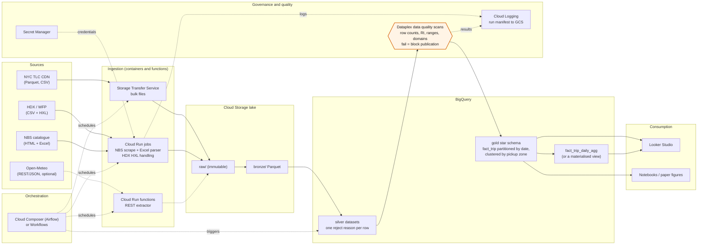

# Cloud Architecture and the BigQuery Comparison

This document covers the **Cloud Platforms for Data Engineering** subtopic
(section 9). It has two halves:

- **C3, a mapping (no code):** each component of the local pipeline mapped to its
  managed equivalent on AWS, GCP and Azure, with the cost and operational
  trade-offs, and a reference architecture.
- **Measured results:** the C1 engine comparison and the C2 scaling curve,
  produced by `make cloud` against the Google BigQuery sandbox.

The cloud module is optional and isolated. It lives in `src/cloud/`, uses
`requirements-cloud.txt`, and runs only via `make cloud`. The core pipeline
never imports it and succeeds whether or not it has ever run.

---

## 1. Read this before any number: the comparison is not a controlled experiment

The two engines were compared on **semantically equivalent questions over
different inputs, on different hardware, through different storage layouts, one
of them across a network**. The results illustrate architectural trade-offs.
They are not a benchmark of one engine's superiority, and must not be cited as
one.

**The year mismatch.** The public dataset `bigquery-public-data.new_york_taxi_trips`
was not maintained past 2022. Its `tlc_yellow_trips_2023` table exists but is
empty, and there is no 2024 table. The local pipeline's corpus is calendar 2024.
So **the cloud side of every comparison reads `tlc_yellow_trips_2019`, and the
local side reads 2024.** The two sides count different trips, and their results
differ for that reason alone.

The full list of confounders appears in this document, in the
`confounders` column of every cloud CSV, and in every cloud figure caption:

| Confounder | Local (DuckDB) | Cloud (BigQuery) |
| --- | --- | --- |
| Data year | 2024 | 2019 (the public dataset ends in 2022) |
| Data volume | the 2024 corpus after structural rejection | the 2019 table, same rejection rules applied as filters |
| Storage | this pipeline's Hive-partitioned ZSTD Parquet | Google-managed columnar storage |
| Hardware | 4-CPU / 8 GB Docker Desktop VM on one laptop | shared, elastically scheduled slot pool of undisclosed size |
| Network | none | job submission and completion polling over the internet |
| "Bytes" | Parquet column-chunk metadata, compressed and uncompressed | logical (uncompressed) bytes of the columns read |
| Cache | warm operating-system page cache | result cache **disabled** for every measurement |

Every cloud figure and CSV is labelled with the exact table and date range it
used.

---

## 2. C3: mapping the local pipeline to managed services

| Local component | What it does | AWS | GCP | Azure |
| --- | --- | --- | --- | --- |
| Docker image + `docker compose` | Packages and runs the pipeline | ECR + ECS on Fargate | Artifact Registry + Cloud Run jobs | ACR + Container Apps jobs |
| `src/pipeline.py`, `Makefile` | Orchestration, stage ordering, reruns | MWAA (managed Airflow) or Step Functions | Cloud Composer (Airflow) or Workflows | Data Factory pipelines |
| Extractors A, B (bulk Parquet/CSV) | Bulk file download | S3 copy from a Fargate or Lambda task; DataSync | Storage Transfer Service | Data Factory copy activity |
| Extractor C (HDX open-data API) | Portal-mediated CSV | Lambda or Glue Python shell job | Cloud Run function | Azure Functions or Data Factory |
| Extractor D (HTML scrape + Excel parse) | Custom parsing of heterogeneous workbooks | Fargate task (no managed connector exists) | Cloud Run job (same reason) | Container Apps job (same reason) |
| Extractor E (REST/JSON) | Small keyless API | Lambda | Cloud Run function | Azure Functions |
| `data/raw/` | Immutable landing zone | S3 | Cloud Storage | ADLS Gen2 |
| Bronze/silver/gold Parquet | Medallion layers | S3 + Apache Iceberg tables | Cloud Storage + BigLake, or native BigQuery tables | ADLS Gen2 + Delta tables (Fabric OneLake) |
| DuckDB engine | SQL over the lake | Athena, or Redshift Serverless | BigQuery | Synapse serverless SQL, or Fabric Warehouse |
| `warehouse.duckdb` (views over Parquet) | Catalogue | Glue Data Catalog | BigQuery datasets + Dataplex | Microsoft Purview / Fabric lakehouse catalogue |
| `config/quality_rules.yaml` + engine | Declarative quality gates | Glue Data Quality (DQDL) | Dataplex data quality scans | Purview data quality / Fabric |
| `outputs/figures`, tables | Reporting | QuickSight | Looker Studio | Power BI |
| `logs/pipeline.log`, run manifest | Observability and provenance | CloudWatch Logs + S3 | Cloud Logging + Cloud Storage | Azure Monitor + ADLS |
| `secrets/`, `.env` | Credentials | Secrets Manager | Secret Manager | Key Vault |

Two components have **no managed equivalent that removes the code**: the NBS
workbook parser (heterogeneous layouts, title banners, trailing commentary
blocks) and the WFP index construction (a chained matched-model Jevons index).
Moving to the cloud changes where that code runs, not whether it has to be
written. This is the ETL chapter's point about extraction cost restated: the
expensive part of this pipeline is per-source logic, which no platform
abstracts away.

### Cost trade-offs (qualitative)

- **Local:** zero marginal cost, bounded capacity. The whole study runs in one
  8 GB container; the ceiling is the laptop, as benchmark B4 (pandas peaking at
  3.5 GB for one aggregation) makes concrete.
- **Serverless query engines (BigQuery on-demand, Athena):** pay per byte
  scanned, with no idle cost. At this study's scale — 1.4 GB of gold Parquet for
  a year of trips — the cost of any single query is small. Cost is governed by
  how many columns a query touches and whether the table is partitioned or
  clustered, which puts the physical design decisions of this pipeline
  (partitioning, column pruning, pre-aggregation) directly on the bill.
- **Provisioned warehouses (Redshift, Synapse dedicated, BigQuery editions):**
  capacity is paid for whether used or not. That suits steady, concurrent
  workloads, not a batch study run a few times.
- **Hidden costs:** storage for every medallion layer (the local asymmetry of
  registering rather than copying the NYC corpus saves money in the cloud as
  well as disk locally), egress when results leave the platform, and
  orchestration services that bill for an always-on environment (managed
  Airflow in particular).

### Operational trade-offs

- **Gained:** elastic scale (C2 shows queries over the whole yellow archive that
  a laptop cannot hold), managed durability, IAM-based access control, and
  audit logging without building any of it.
- **Lost or made harder:** reproducibility for an examiner (a cloud run needs an
  account, credentials and a network; `docker compose up` needs only Docker),
  cost predictability, and portability. Each managed service in the table is a
  point of vendor lock-in that a Parquet-plus-DuckDB design avoids.
- **Unchanged:** data quality. The quality gates, the reject reasons and the
  reconciliation against NBS are properties of the pipeline's logic and would
  have to be carried over whichever platform ran it.

---

## 3. Reference architecture (GCP, since GCP is what was measured)

The design choice that matters most for cost carries straight over from the
local pipeline. Partitioning `fact_trip` by pickup date and clustering it by
pickup zone lets BigQuery prune both, so a one-month query bills one month.
Whether the *public* TLC tables are partitioned is recorded in
`outputs/cloud/table_inventory.csv`, and the C2 one-month step shows the
consequence directly.

---

## 4. How the measurement was protected

- **Verify before using (C0).** The dataset's tables, row counts, sizes, schema
  types and partitioning are read from the BigQuery metadata API, which costs
  nothing, and written to `outputs/cloud/table_inventory.csv`. The module stops
  if `tlc_yellow_trips_2019` or `taxi_zone_geom` is missing or empty. No table
  name or row count is assumed.
- **Byte budget.** Every query is dry-run first (free), and the whole plan is
  checked against the allowance before anything runs. The allowance is the
  smaller of a 200 GiB session cap and 80% of whatever free-tier headroom
  remains this month. This month's prior usage is read from
  `INFORMATION_SCHEMA` where the service account may read it; when it cannot,
  the manifest records that zero prior usage was assumed. Remaining headroom is
  logged after every query.
- **No cache.** The BigQuery result cache is disabled for every measurement. A
  cached result bills zero bytes and returns instantly, which would falsify both
  latency and cost.
- **Semantic equivalence.** The BigQuery C1 query applies the same structural
  validity rules as the local silver layer, so both sides count "structurally
  valid trips by borough, ISO weekday and hour". The two SQL files sit side by
  side in `sql/cloud/`.
- **Pricing.** Implied cost uses a configured on-demand rate
  (`BQ_ON_DEMAND_USD_PER_TIB`). At runtime the module tries to confirm it on
  Google's pricing page, and records whether it could. It is never a remembered
  number presented as current.
- **Credentials** are read from `GOOGLE_APPLICATION_CREDENTIALS`, mounted
  read-only, excluded from git and the image, and never printed.

---

## 5. Measured results

All figures below come from one run of `make cloud`, recorded in
`outputs/cloud/*.csv` and in the `cloud` block of `docs/run_manifest.json`.

### C0: the dataset, verified

27 tables, read from the metadata API at no cost, matching the expected
inventory: yellow trips 2011–2022 (plus an empty 2023 table), green trips
2014–2023 (2023 empty), for-hire-vehicle trips 2015–2017, and `taxi_zone_geom`
(263 rows). `tlc_yellow_trips_2019` holds 84,598,433 rows (15.1 GB logical); the
largest table, `tlc_yellow_trips_2014`, holds 275,921,951. **None of the 27 tables
is partitioned or clustered**, which C2 shows is expensive.

### C1: the A1 demand profile on both engines

| | Local DuckDB | BigQuery sandbox |
| --- | --- | --- |
| Input | local `fact_trip`, pickups 2024-01-01 to 2024-12-31 | `tlc_yellow_trips_2019`, pickups 2019-01-01 to 2019-12-31 |
| Trips counted | 40,421,100 | 84,347,563 |
| Columns read | 3 | 7 |
| Bytes | 41.1 MB compressed on disk; 462.6 MB logical | 6.0 GB processed and billed (logical) |
| Latency, median of 3 | **50.4 s** (range 36.0–59.8 s) | **3.15 s** (range 2.80–3.53 s) |
| Compute | 4 threads | ~176 slot-seconds per run |
| Implied cost per run | none | $0.0369 at 6.25 USD/TiB (configured rate, **not confirmed** on the pricing page at runtime) |

How to read it, and how not to:

- **BigQuery was about 16× faster on about twice as many trips**, by spending
  roughly 176 slot-seconds of compute in about three seconds of wall time: the
  work of dozens of workers at once, against four local threads. That is the
  architectural difference the comparison illustrates, not a verdict on either
  engine.
- **BigQuery read 7 columns and 6.0 GB; DuckDB read 3 columns and 41 MB.** The
  public table is raw, so the structural validity rules have to be applied at
  query time, which reads the timestamp, distance, fare, total, passenger and
  zone columns. Locally those rules ran once, in the silver layer, and the gold
  fact already holds only valid trips. **Cleaning once upstream is what shrinks
  every downstream scan**, and on a pay-per-byte engine it would shrink every
  bill too.
- **The local query deliberately mirrors BigQuery's shape**, grouping by the
  borough *name* after a dimension join, so that both engines run the same
  logical plan. The pipeline's own A1 query groups on integer codes and answers
  the same question locally in about 29–33 s. The local timings also varied from
  36 to 60 s across repeats, which signals contention on the host.
- Every confounder in section 1 applies, the year mismatch above all.

### C2: one query, one month to the whole archive

The C2 query reads only the pickup timestamp and counts trips by ISO weekday and
hour. Every step is a single run with the cache disabled.

| Step | Input | Trips | Bytes processed | Seconds to complete | Slot-seconds | Implied cost |
| --- | --- | --- | --- | --- | --- | --- |
| one month | `tlc_yellow_trips_2019`, 2019-01-01 to 2019-01-31 | 7,696,390 | **645.4 MB** | 1.22 | 9.8 | $0.0039 |
| one year | `tlc_yellow_trips_2019`, all of 2019 | 84,598,433 | **645.4 MB** | 1.39 | 16.2 | $0.0039 |
| largest single table | `tlc_yellow_trips_2014`, all rows | 275,921,951 | 2.1 GB | 1.91 | 91.7 | $0.0126 |
| full yellow archive | 12 tables, `tlc_yellow_trips_2011` to `_2022` | **1,564,962,831** | 11.7 GB | **2.57** | 554.3 | $0.0712 |
| *local reference* | *local `fact_trip`, 2024* | *40,421,100* | *308.4 MB logical* | *13.4 (median of 3)* | — | — |

What the curve shows:

- **One month billed exactly what the whole year billed.** The public tables are
  unpartitioned, so a date filter cannot prune and BigQuery bills the full column.
  This is the cloud's version of benchmark B2. Partitioning `fact_trip` by date,
  as this pipeline's gold layer does and as the reference architecture in
  section 3 recommends, is what would make a one-month query bill one month.
- **Bytes grow linearly with rows**, at about 8 bytes per trip: one timestamp
  column.
- **Latency barely grows.** An input 200 times larger (7.7 million to 1.56
  billion trips) took about twice as long: 1.2 s to 2.6 s. BigQuery absorbed the
  extra work by adding slots. The full-archive job consumed 554 slot-seconds in
  1.55 s of server time, roughly 358 slots on average.
- **This is the curve a laptop cannot produce.** The archive's 12 tables total
  about 275 GB logical, roughly ninety times this project's 3 GB disk budget. The
  local point is a reference on different hardware and a different year, not a
  comparable measurement.

### Budget and provenance

- **Spent:** 33.1 GB processed across 9 measured queries, against a 200 GB
  session allowance (166.9 GB headroom left), which is about 3% of the 1 TiB
  monthly free tier. The whole plan was dry-run and checked against the budget
  before any query ran.
- **Prior usage this month:** `INFORMATION_SCHEMA.JOBS_BY_PROJECT` was denied
  (the sandbox service account lacks `bigquery.jobs.listAll`).
  `JOBS_BY_USER` returned 0 bytes billed, but **that covers this service
  account's own jobs only**. Usage by other principals in the project is not
  visible. The 200 GB session cap, a fifth of the free tier, keeps the run safe
  regardless.
- **Pricing:** the configured 6.25 USD/TiB could not be confirmed on the pricing
  page at runtime. Every implied cost above is labelled as resting on an
  unverified configuration value.
