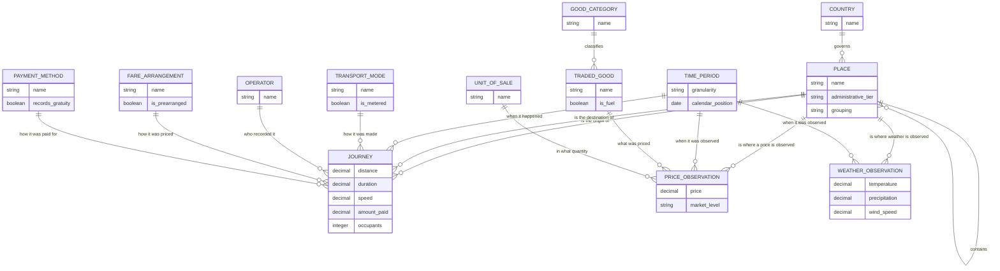

# Conceptual Entity-Relationship Model

Entities and relationships only — no keys, no types, no physical detail. This is
the model of the *problem domain*, before any decision about how to store it.
The physical realisation is in [`erd_star_schema.md`](erd_star_schema.md).

The domain is the **economics of movement**, observed in two countries at very
different resolutions: individual journeys in New York City, and the prices of
the goods and fuel whose movement those journeys are an instance of in Nigeria.

## The three observation entities, and why they are one model

`JOURNEY`, `PRICE_OBSERVATION` and `WEATHER_OBSERVATION` are the only entities
that record something happening in the world. Everything else describes *context*
in which those observations sit.

They are modelled together, rather than as three separate models, because they
share the two context entities that matter most:

- **`PLACE`** — every observation happens somewhere.
- **`TIME_PERIOD`** — every observation happens at some time.

That shared context is the entire justification for a conformed dimensional
model, and the reason this study can pose a question (A9) that spans two
independently collected sources.

## `PLACE` is recursive, and that is the crux

`PLACE ||--o{ PLACE : contains` is the most consequential relationship in the
model. A place contains other places, to an arbitrary and **uneven** depth:

- United States → borough → taxi zone
- Nigeria → state → market

The two branches have different depths and different meanings at each tier, and
observations attach at different tiers: a journey attaches at the *zone* tier, a
food price at the *market* tier, a fuel price at the *state* tier, weather at the
*city* tier.

Modelling this as one recursive entity — rather than as separate `Borough`,
`Zone`, `State` and `Market` entities — is what makes a single join path reach
all of them. It is also what forces the ragged hierarchy, the `admin_level`
discriminator, and the explicit market→state bridge that A9 needs. The benefit
and the cost come from the same decision.

## Relationships deliberately absent

Three relationships a reader might expect are **not** in this model, because the
data cannot support them:

- **`PRICE_OBSERVATION` for fuel → `JOURNEY`.** There is no connection between
  Nigerian fuel prices and New York taxi journeys. The two halves of the study
  are a *comparison* of engineering problems, not a causal system.
- **`WEATHER_OBSERVATION` → `JOURNEY` as an explanatory link.** Weather is
  contextual only. It exists to demonstrate that a REST/JSON source conforms to
  the same time dimension; no demand model is built on it.
- **A quantity or weight on `PRICE_OBSERVATION`.** WFP publishes prices, not
  consumption quantities. Without quantities there is no expenditure weighting,
  which is precisely why the index in A6 is unweighted. The absence is modelled
  honestly rather than filled with an assumption.
