# Star Schema: Three Grains, One Set of Conformed Dimensions

This is the visual centrepiece of the design chapter. It shows the claim the
whole study is built to test: that **one conformed dimensional model can serve
fact tables whose grains differ by several orders of magnitude**, and that the
cost of doing so is measurable rather than theoretical.

Read the diagram by grain, not by table count. The three fact tables differ in
row count by a factor of roughly **35,000**, yet every one of them joins to the
same `dim_date` and the same `dim_geography`.

```mermaid
erDiagram
    DIM_DATE ||--o{ FACT_TRIP : "pickup_date_key"
    DIM_DATE ||--o{ FACT_TRIP : "dropoff_date_key"
    DIM_DATE ||--o{ FACT_TRIP_DAILY_AGG : "date_key"
    DIM_DATE ||--o{ FACT_MARKET_PRICE_MONTHLY : "month_key"
    DIM_DATE ||--o{ FACT_FUEL_PRICE_MONTHLY : "month_key"
    DIM_DATE ||--o{ FACT_WEATHER_DAILY : "date_key"

    DIM_GEOGRAPHY ||--o{ FACT_TRIP : "pickup_geo_key"
    DIM_GEOGRAPHY ||--o{ FACT_TRIP : "dropoff_geo_key"
    DIM_GEOGRAPHY ||--o{ FACT_TRIP_DAILY_AGG : "pickup_geo_key"
    DIM_GEOGRAPHY ||--o{ FACT_MARKET_PRICE_MONTHLY : "geo_key (market)"
    DIM_GEOGRAPHY ||--o{ FACT_FUEL_PRICE_MONTHLY : "geo_key (state)"
    DIM_GEOGRAPHY ||--o{ FACT_WEATHER_DAILY : "geo_key (city)"

    DIM_TRANSPORT_MODE ||--o{ FACT_TRIP : "mode_key"
    DIM_TRANSPORT_MODE ||--o{ FACT_TRIP_DAILY_AGG : "mode_key"
    DIM_COMMODITY ||--o{ FACT_MARKET_PRICE_MONTHLY : "commodity_key"
    DIM_PAYMENT_TYPE ||--o{ FACT_TRIP : "payment_key"
    DIM_RATE_CODE ||--o{ FACT_TRIP : "rate_key"
    DIM_VENDOR ||--o{ FACT_TRIP : "vendor_key"
    DIM_TRIP_FLAGS ||--o{ FACT_TRIP : "flag_key"

    DIM_DATE {
        int date_key PK "YYYYMMDD, -1 = Unknown"
        date full_date
        smallint year
        tinyint day_of_week "ISO 1=Mon"
        varchar year_month
        boolean is_weekend
    }
    DIM_GEOGRAPHY {
        int geo_key PK "-1 = Unknown"
        varchar geo_code "natural key"
        varchar geo_name "TYPE 2 tracked"
        varchar country "US or Nigeria"
        varchar admin_level "zone|market|state|city"
        varchar parent_geo_name "TYPE 2 tracked"
        varchar region_group "TYPE 2 tracked"
        date valid_from "TYPE 2"
        date valid_to "TYPE 2, 9999-12-31 if current"
        boolean is_current "TYPE 2"
    }
    DIM_TRANSPORT_MODE {
        int mode_key PK
        varchar mode_code
        varchar mode_category
        boolean is_metered
    }
    DIM_COMMODITY {
        int commodity_key PK
        varchar commodity_name
        varchar unit "part of the grain"
        varchar category
        boolean is_fuel
    }
    DIM_PAYMENT_TYPE {
        int payment_key PK
        varchar payment_type_name
        boolean is_tip_observable "card only"
    }
    DIM_RATE_CODE {
        int rate_key PK
        varchar rate_code_name
        boolean is_airport_rate
    }
    DIM_VENDOR {
        int vendor_key PK
        varchar vendor_name
    }
    DIM_TRIP_FLAGS {
        int flag_key PK "junk dimension"
        varchar store_and_fwd_flag
        boolean is_airport_trip
        boolean has_tip
        boolean has_toll
    }

    FACT_TRIP {
        varchar trip_id "degenerate, deterministic"
        int pickup_date_key FK
        int pickup_geo_key FK
        tinyint pickup_hour
        double trip_distance_miles
        int trip_duration_seconds
        double avg_speed_mph
        double fare_amount
        double tip_amount
        double total_amount
    }
    FACT_TRIP_DAILY_AGG {
        int date_key FK
        int pickup_geo_key FK
        bigint trip_count
        double total_revenue
        double median_fare "NOT re-aggregable"
    }
    FACT_MARKET_PRICE_MONTHLY {
        int month_key FK
        int geo_key FK "market tier"
        int commodity_key FK
        varchar price_type
        double price_ngn
        int observation_count
    }
    FACT_FUEL_PRICE_MONTHLY {
        int month_key FK
        int geo_key FK "state tier"
        varchar fuel_type
        double price_ngn
        double mom_pct_change "computed here"
    }
    FACT_WEATHER_DAILY {
        int date_key FK
        int geo_key FK "city tier"
        double temp_max_c
        double precipitation_mm
    }
```

## The multi-grain structure at a glance

| Fact table | Grain | Order of magnitude | Geography tier joined |
| --- | --- | --- | --- |
| `fact_trip` | one completed taxi trip | ~10⁷ rows | zone |
| `fact_trip_daily_agg` | date × pickup zone × mode | ~10⁴ rows | zone |
| `fact_market_price_monthly` | market × commodity × price type × month | ~10⁴ rows | market |
| `fact_fuel_price_monthly` | state × month | ~10³ rows | state |
| `fact_weather_daily` | date × geography | ~10² rows | city |

`dim_geography` is the join that makes this work. It is **ragged**: a single
dimension serves four administrative tiers across two countries, so a New York
taxi zone and a Nigerian state are reachable by the same join path rather than
through separate per-country dimensions.

## What the ragged hierarchy costs

The design is not free, and the paper should say so:

- **A9 needs an explicit bridge.** `fact_market_price_monthly` sits at the
  *market* tier while `fact_fuel_price_monthly` sits at the *state* tier, so
  joining them requires hopping `market → parent_geo_name → state`. A
  per-country star with a dedicated Nigerian state dimension would have made
  that join direct.
- **Attribute sparsity.** `region_group` means "TLC service zone" for a New York
  zone and "geopolitical zone" for a Nigerian state. One column, two semantics,
  disambiguated only by `admin_level`.
- **Type 2 versioning applies to all tiers equally**, including tiers that will
  never change, which costs three extra columns on every row of the dimension.

These costs are small in absolute terms — `dim_geography` is a few hundred rows
— and that asymmetry is precisely the finding: the conformance cost falls on the
*dimension*, which is tiny, while the benefit falls on every *fact*, including
the one with 40 million rows.
